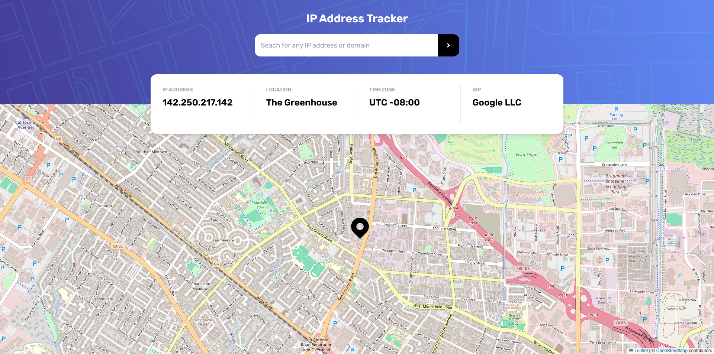
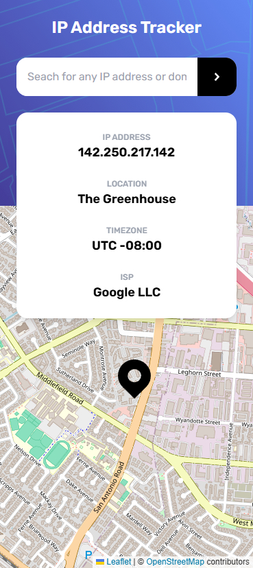

# Frontend Mentor - IP address tracker solution

This is a solution to the [IP address tracker challenge on Frontend Mentor](https://www.frontendmentor.io/challenges/ip-address-tracker-I8-0yYAH0). Frontend Mentor challenges help you improve your coding skills by building realistic projects. 

## Table of contents

- [Overview](#overview)
  - [The challenge](#the-challenge)
  - [Screenshot](#screenshot)
  - [Links](#links)
- [My process](#my-process)
  - [Built with](#built-with)
  - [What I learned](#what-i-learned)
  - [Continued development](#continued-development)
  - [Useful resources](#useful-resources)
- [Author](#author)

## Overview

### The challenge

Users should be able to:

- View the optimal layout for each page depending on their device's screen size
- See hover states for all interactive elements on the page
- See their own IP address on the map on the initial page load
- Search for any IP addresses or domains and see the key information and location

### Screenshot

|  |  |
|:------------------------------:|:------------------------------:|
| screenshot of the site on a PC     | screenshot of the site on mobile devices     |

### Links

-  [Solution URL](https://www.frontendmentor.io/solutions/ip-address-tracker-solution-TB0hQYZ6--)
- [Live Site URL](https://ip-address-tracker-pex-dev.netlify.app/)

## My process

### Built with

- Semantic HTML5 markup
- Tailwind CSS Styles
- Mobile-first workflow
- [React](https://reactjs.org/) - JS library
- [React Leaflet](https://react-leaflet.js.org/) - JS library

### What I learned

During this project, I deepened my understanding of React by learning how to create reusable components and pass information between them using props. I also gained practical experience with the Context API for managing global state efficiently. Additionally, I improved my knowledge of Tailwind CSS, using it to quickly implement responsive and visually appealing designs. This project helped me solidify these skills while working on a real-world application.
  
### Continued development

In the coming months, I plan to deepen my understanding of React by exploring more advanced features such as custom hooks, state management techniques, and performance optimization. Additionally, I want to enhance my proficiency in creating responsive and visually appealing designs using Tailwind CSS. By focusing on these areas, I aim to build more dynamic, efficient, and user-friendly applications.

### Useful resources

- [React Leaflet](https://www.example.com) - It was very helpful to integrate the map with REACT more easily.

## Author

- Frontend Mentor - [@Pex-Dev](https://www.frontendmentor.io/profile/Pex-Dev)
- GitHub - [@Pex-Dev](https://github.com/Pex-Dev)

